# Intro

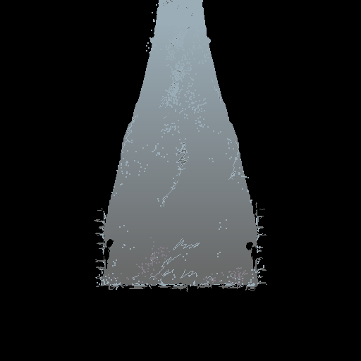
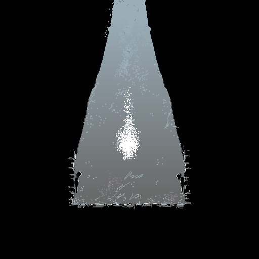
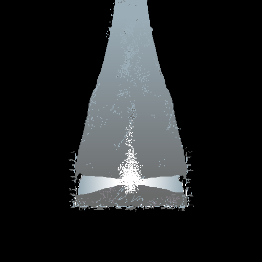

The Spirit descends into the crypt to reawaken the elemental catalysts for their journey to bring back balance to the elements after their thousand-year slumber.
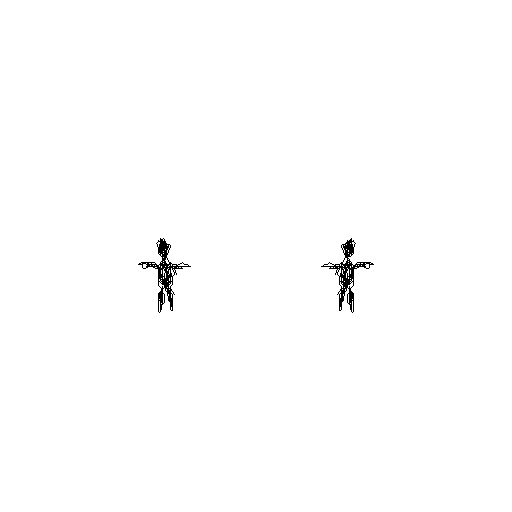
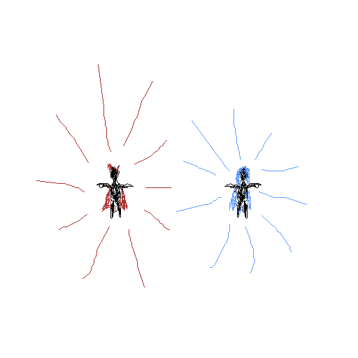
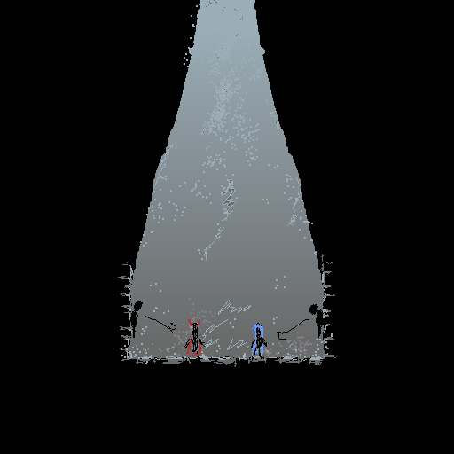

The spirit is gone after the transformation and the characters find themselves in a crypt. 
*The players gain control of the characters and start with the first level*

The first couple of levels explain the reason for why the catalysts were awakened with pictograms and statues.

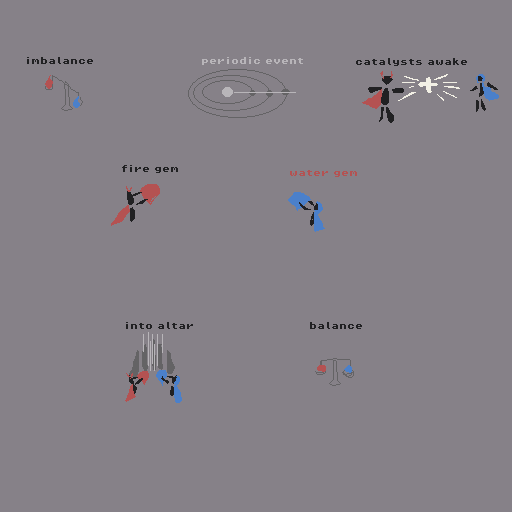

Catalysts learn this in the first crypt-levels. This means that they know about the plot before leaving the crypt.

# Mid Game

The last level of the crypt grants the catalysts their first elemental ability (fire and water ball) and teaches them how to use it.

After that the catalysts will be going into a series of "open" grass land levels and make their way over to the fire temple.
The fire temple is guarded by a water-zone to depict that this mission needs cooperation of the elements.

After a series of fire-themed levels, the fire-catalyst picks up the fire gem and the catalysts make their way into a series of grass land levels.

The grass land levels lead the catalysts to the water temple which is in turn guarded by a fire-zone.
After the water-based levels, the water-catalyst picks up the water gem and the catalysts travel on.

# End Game

The following levels should be the most complex.After a series of these the catalysts reach the altar to place the gems into and fulfill their destiny.

# End

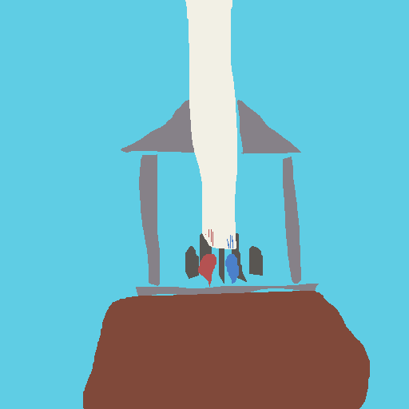

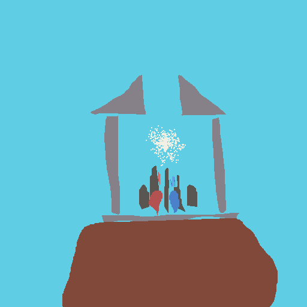
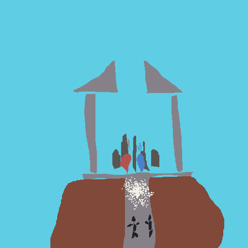
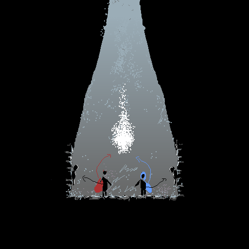

